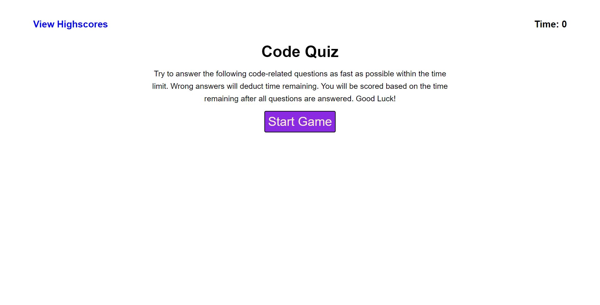
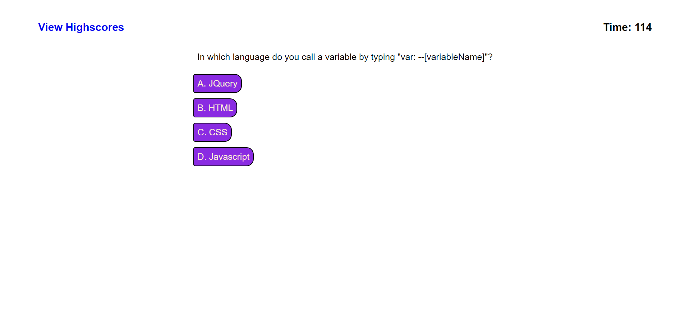
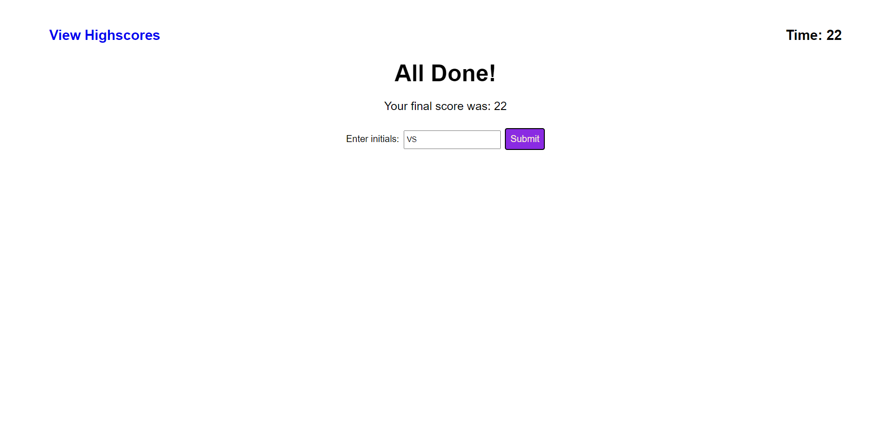

# code-quiz

## Description

This project involves creating a quiz application that takes user input to cycle through multiple choice questions. A timer is implemented as a scoring system, as any answer will progress the quiz, but an incorrect answer will deduct some time from the timer. This process demanded knowledge of javascript and web APIs, local storage, and use of multiple HTMLs.

## Procedure and Challenges

As this is an even-numbered project, I began with the basic skeleton of the look of the program. I added the requisite classes and elements in HTML and CSS, producing the instructions/landing page. This page showed a link to the high scores, which was another page in another HTML. As a design decision, I kept the multiple choice, feedback (right/wrong) prompt, and the input within the HTML, but not displayed using CSS. That way, javascript can manipulate the style later to show them when necessary, and new elements won't need to be instantiated in javascript.

Then, I took to planning and creating the javascript logic. The code begins with the start button, which calls all the initial functions and sets all the intial variables. I planned to have around 6 questions, in a random order, and with the multiple choice in random order as well. This required a shuffle function, which took some external research. After showing the multiple choice buttons, I created a timer, and a function that produces a new question. When the timer reaches 0 or all the questions have been answered, an end game function is then called. This reveals the hidden element, the initials input for storing the score, and removes the multiple choice buttons. The score and initials are stored in a string in local storage, and taken into the highscores.html.

A problem arose then: local storage only persists between pages when a page is deployed. Thus, testing code in highscores.html would be exceeding difficult, but somehow I managed to make it work. However, the final result produces an initial, empty li element at the top sometimes, depending on the browser I use. I could consider this a decoration, but it is clearly a bug that I cannot address with the time remaining to me. The name and score saving works for the most part other than that bug, and from the screenshots, the app works better on google chrome rather than on firefox.

## Screenshots

* Front Page

* Multiple Choice Question

* Results Page

* High Score Page

## Credits

Credit to https://javascript.info/task/shuffle and https://sebhastian.com/fisher-yates-shuffle-javascript/ for implementation of shuffling.

## Github Deployed Site Link and Repository Link

Github Repository: https://github.com/voravichs/code-quiz

Github Pages Deployment: https://voravichs.github.io/code-quiz/index.html

